In Februrary 2019, I was contracted by
[AXR Edge](https://www.axredge.com/) (formerly known as Axis Replay)
to design and develop a new website built on Wordpress
*(note: the website has since been redesigned)*.
My main responsibilities included designing and developing a custom Wordpress theme
for the new website, as well as designing new branding guidelines for digital media.
I worked closely with stakeholders over the course of several months to iterate on the design
and reach a product that the client was happy with.
This process utilized UI mockups made in
[Adobe Illustrator](https://www.adobe.com/products/illustrator.html),
which also evolved into a short digital branding style guide to accompany the website design.

My work on the development of the website included:
- Ensuring the site was responsive and mobile-friendly
- Writing jQuery code to handle various UI interactions
- Integrating the
  [Google Maps Embed API](https://developers.google.com/maps/documentation/embed/get-started)
  to display a map of the company's primary location
- A full-screen social media "wall" that displays the latest posts
  from the company's social media accounts,
  to be displayed on a large screen in the the company's office
- Short sections of PHP code to handle including common files in a modular way
- A substantial amount of configuration of Wordpress plugins to handle various features of the website,
  such as the event calendar, contact form, ticket purchasing system, and the social media wall

## Screenshots

Below is a gallery of screenshots from areas of the website that I designed and developed.

### Common elements

<Figure>
  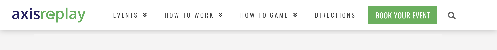
  <figcaption>
    Main navigation header, present on every page.
    A call-to-action is prominently displayed on the header ("Book your event"),
    in addition to a collection of the most important links for prospective customers.
    The menu items collapse into a hamburger menu on mobile.
  </figcaption>
</Figure>

<Figure>
  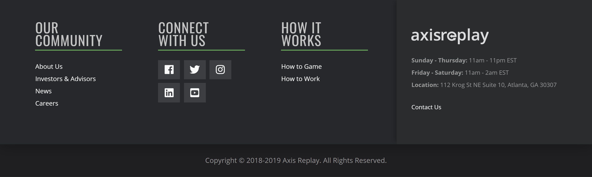
  <figcaption>
    Navigation footer, present on every page.
  </figcaption>
</Figure>

<Figure>
  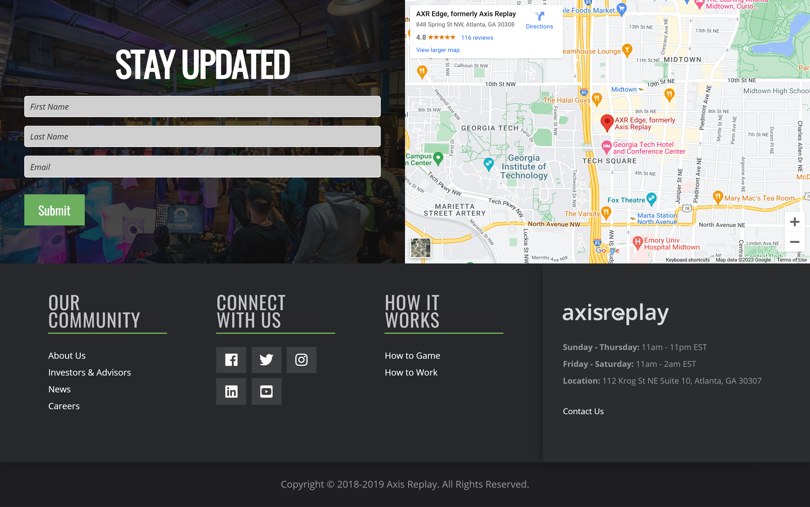
  <figcaption>
    Expanded navigation footer that is used on the homepage.
  </figcaption>
</Figure>

### Homepage

<Figure>
  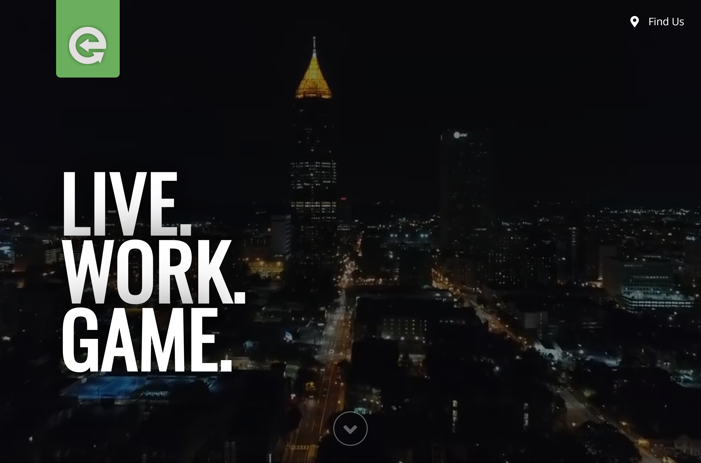
  <figcaption>
    Landing section on the homepage.
    A full-screen background video plays behind the business's slogan at the time,
    "Live, Work, Game."
  </figcaption>
</Figure>

<Figure>
  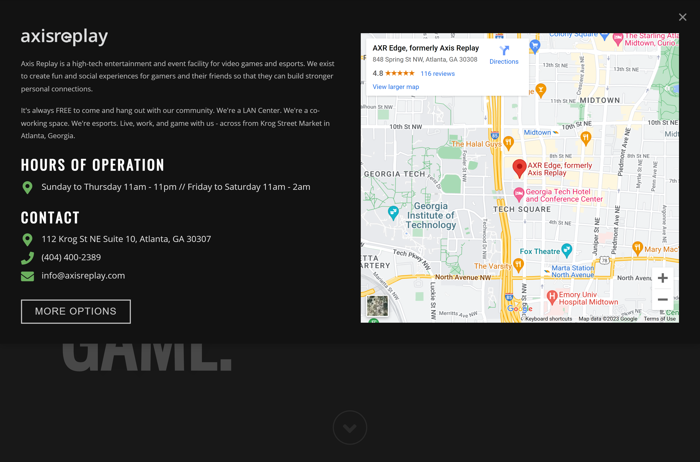
  <figcaption>
    Expanded top drawer of the landing section on the homepage.
    This is opened by pressing the "Find Us" button,
    and provides quick access to information about the company.
    It features a Google Maps embed that displays the company's primary location.
  </figcaption>
</Figure>

<Figure>
  
  <figcaption>
    Various sections of the homepage,
    using different full-bleed designs to contain content.
  </figcaption>
</Figure>

### Event calendar page

<Figure>
  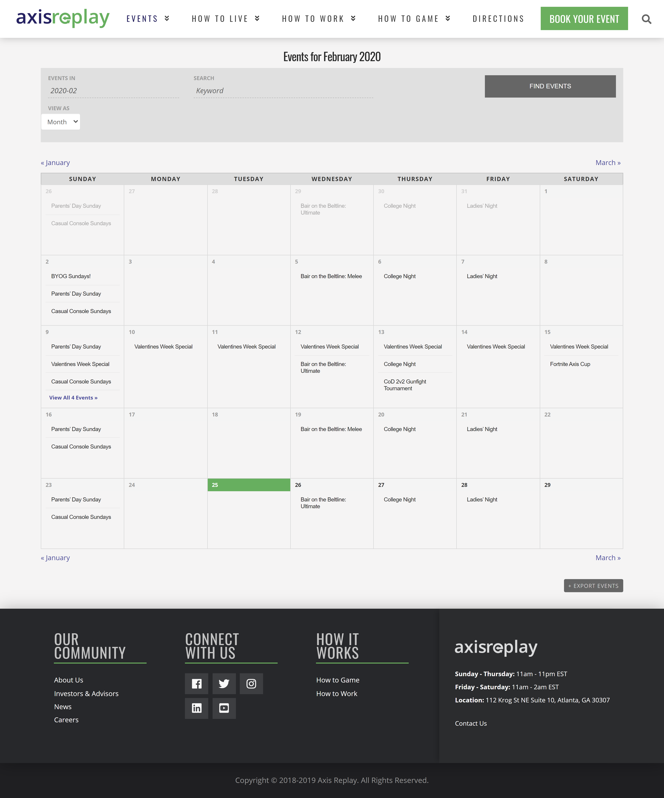
  <figcaption>
    Event calendar page. This pulls events from Wordpress CMS data,
    which can easily be edited by website administrators.
  </figcaption>
</Figure>

### Contact page

<Figure>
  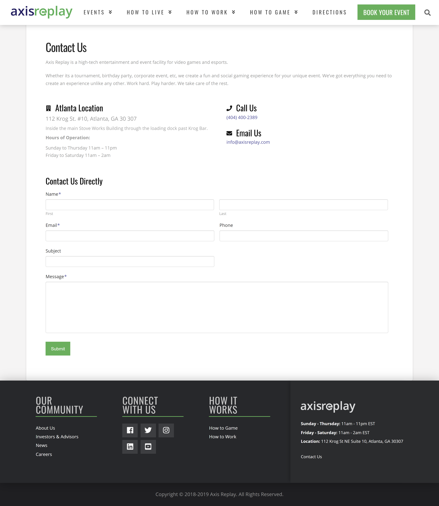
  <figcaption>
    Contact page, which features a contact form that feeds into the Wordpress CMS using a plugin.
  </figcaption>
</Figure>

## UI Mockups

The following gallery shows early UI mockups created in Adobe Illustrator
as part of the design process for the website.

<Figure>
  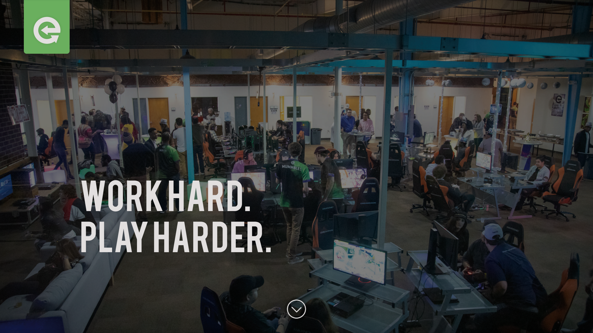
  <figcaption>
    Mockup for the full-screen landing section on the homepage.
  </figcaption>
</Figure>

<Figure>
  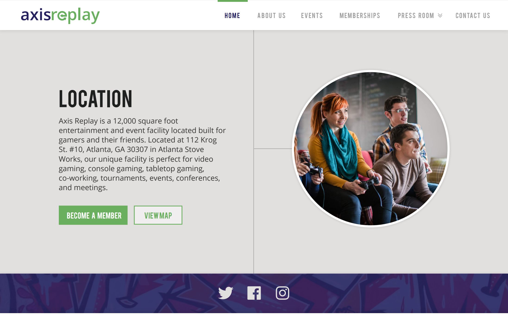
  <figcaption>
    Mockup for the site-wide header and the intro content on the homepage.
  </figcaption>
</Figure>

<Figure>
  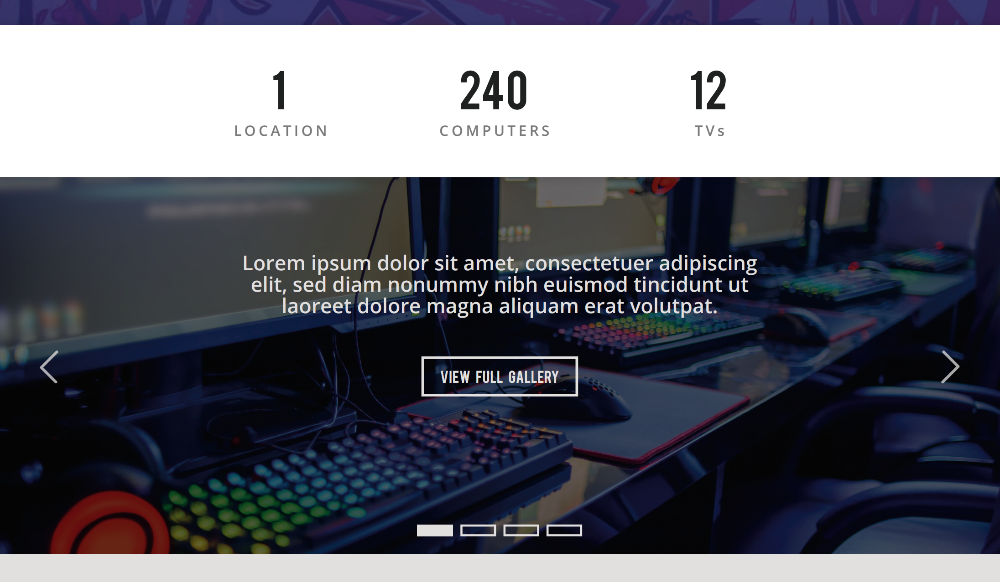
  <figcaption>
    Mockup for various content sections on the homepage.
  </figcaption>
</Figure>

<Figure>
  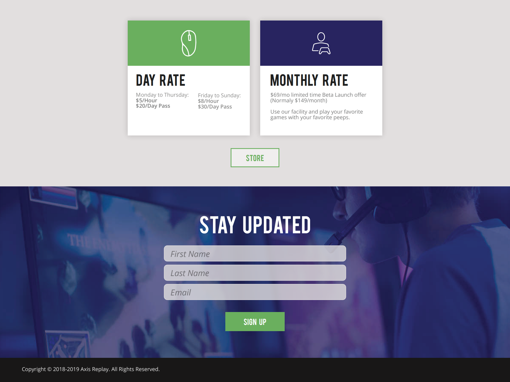
  <figcaption>
    Mockup for the site-wide footer and the newsletter section at the bottom of the homepage.
  </figcaption>
</Figure>

## Branding guidelines

The following collection of design elements consistitutes the digital branding guidelines
that I compiled and developed for the company.
These were made in tandem with the UI mockups,
and served as the basis for the final website design
(as well as other digital branding elements made by the company).

Note that neither me nor this site is endorsed by or directly affiliated with AXR Edge
(formerly known as Axis Replay).
The use of these branding elements is included here only as an example of my work
in developing a digital brand identity,
and should not be confused for any association with the company.

### Fonts

import FontDisplay from "../../../src/components/FontDisplay";
import IncludeFonts from "../../../src/components/IncludeFonts";

<IncludeFonts fonts={{
  "Bebas": "/projects/axis-replay/fonts/bebas/Bebas-Regular.otf",
  "Open Sans": "/projects/axis-replay/fonts/open-sans/OpenSans-Regular.ttf",
  "Notera": "/projects/axis-replay/fonts/notera/Notera.ttf",
}} />
<FontDisplay>
  <FontDisplay.Font
    fontFamily="Bebas"
    name="Bebas"
    role="Headings & UI Elements"
    link="http://bebasfont.com/"
    exampleStyle={{ fontSize: 24, lineHeight: 1.2 }}
    halfWidthOnDesktop
  >
    Lorem ipsum dolor sit amet, consectetur adipiscing elit.
  </FontDisplay.Font>
  <FontDisplay.Font
    fontFamily="Notera"
    name="Notera"
    role="Logo Tagline"
    link="https://www.dafont.com/notera.font"
    nameStyle={{ marginBottom: -8 }}
    exampleStyle={{ fontSize: 30, lineHeight: 1.2 }}
    halfWidthOnDesktop
  >
    Work Hard. Play Harder.
  </FontDisplay.Font>
  <FontDisplay.Font
    fontFamily="Open Sans"
    name="Open Sans"
    role="Body Text"
    link="https://fonts.google.com/specimen/Open+Sans"
    nameStyle={{ fontSize: 36, marginTop: -10 }}
    exampleStyle={{ fontSize: 15 }}
  >
    Orci varius natoque penatibus et magnis dis parturient montes, nascetur ridiculus mus.
    Aliquam erat volutpat. Maecenas vitae dapibus neque. Mauris interdum eu urna nec egestas.
    Fusce eleifend convallis nunc, id eleifend augue accumsan a.
    Nunc et arcu varius, sagittis nulla quis, fermentum massa.
    Nam in diam id ipsum feugiat rhoncus. Curabitur hendrerit eu purus nec placerat.
    Aenean mattis iaculis sapien ac consequat. Fusce tempus id ex eu efficitur.
  </FontDisplay.Font>
</FontDisplay>

### Logos

import WordmarkLogo from "./local/logo/wordmark.inline.svg";
import IconLogo from "./local/logo/icon.inline.svg";
import { shadow } from "../../../src/theme/shadows";

These logos existed prior to my involvement;
they're only included for completeness.

| Role     | Logo                                                                                                                                       |
| -------- | ------------------------------------------------------------------------------------------------------------------------------------------ |
| Wordmark | <WordmarkLogo style={{ width: 480, maxWidth: "100%", backgroundColor: "white", padding: 16, borderRadius: 8, boxShadow: shadow("z2") }} /> |
| Icon     | <IconLogo style={{ width: 130, maxWidth: "100%", backgroundColor: "white", padding: 16, borderRadius: 8, boxShadow: shadow("z2") }}/>      |

### Colors

import ColorDisplay from "../../../src/components/ColorDisplay";

<ColorDisplay>
  <ColorDisplay.Color color="#FFFFFF" name="Light" />
  <ColorDisplay.Color color="#E2DFDF" name="Light alternate" />
  <ColorDisplay.Color color="#222222" name="Dark" />
  <ColorDisplay.Color color="#292562" name="Accent 1" />
  <ColorDisplay.Color color="#69AE5E" name="Accent 2" />
</ColorDisplay>

### Design elements

import { cardImageClass } from "../../../src/components/Article";
import GrungeDemo from "./local/design_elements/GrungeDemo";

- Uppercase headings and UI elements
  

    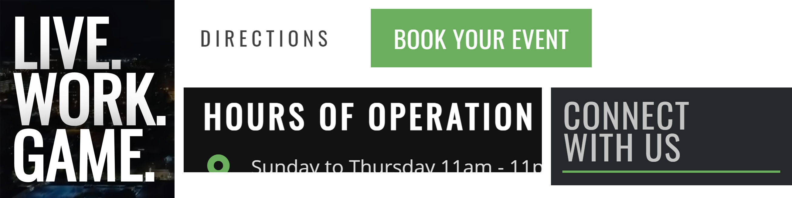
  

- Square edges on UI elements
  

    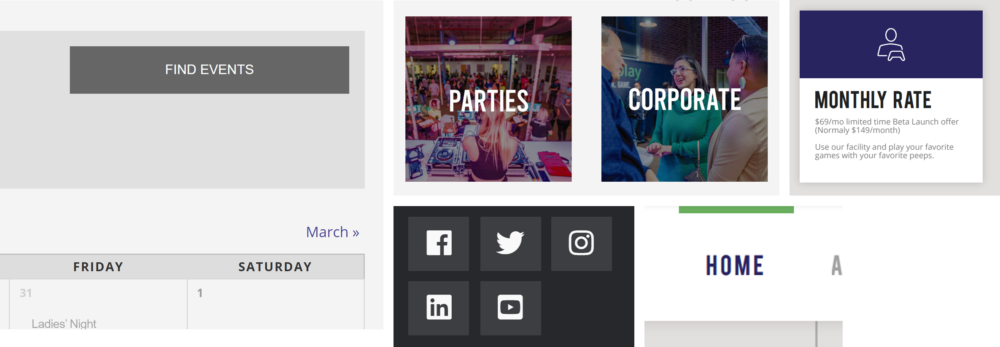
  

- Drop shadows and background colors to create layers
  ([Material-design](https://m2.material.io/design/environment/elevation.html#elevation-in-material-design) style)
  

    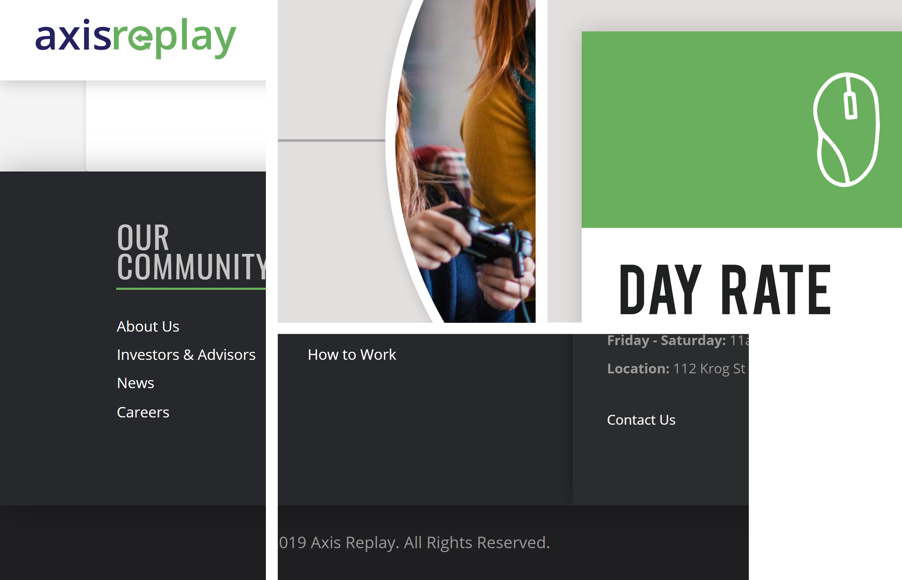
  

- Full-bleed elements, using solid color or image backgrounds with color overlays
  

    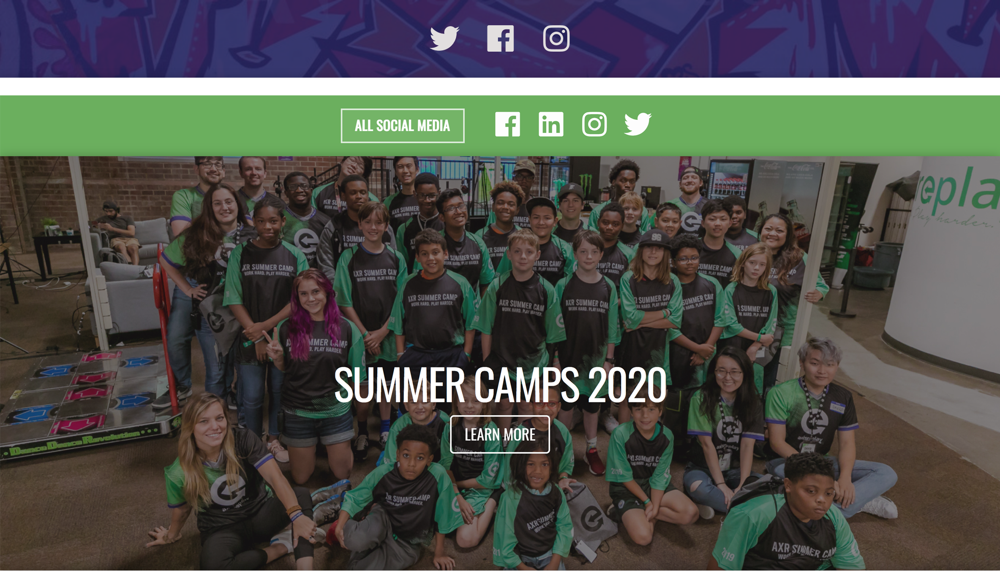
  

- Button styles (both solid and outline)
  

    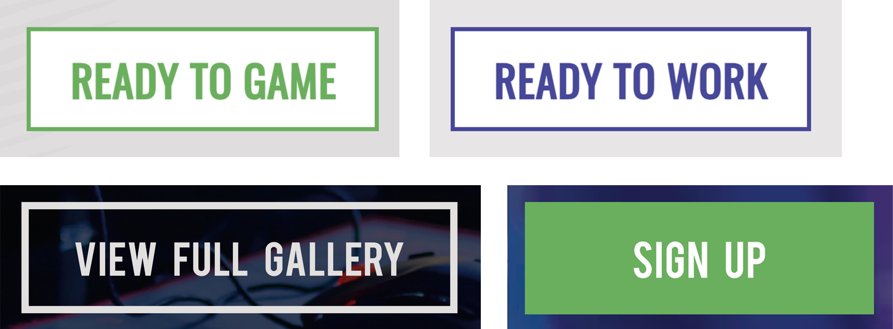
  

- Grunge background textures
  <GrungeDemo style={{ maxWidth: 800, marginTop: -13 }}>
    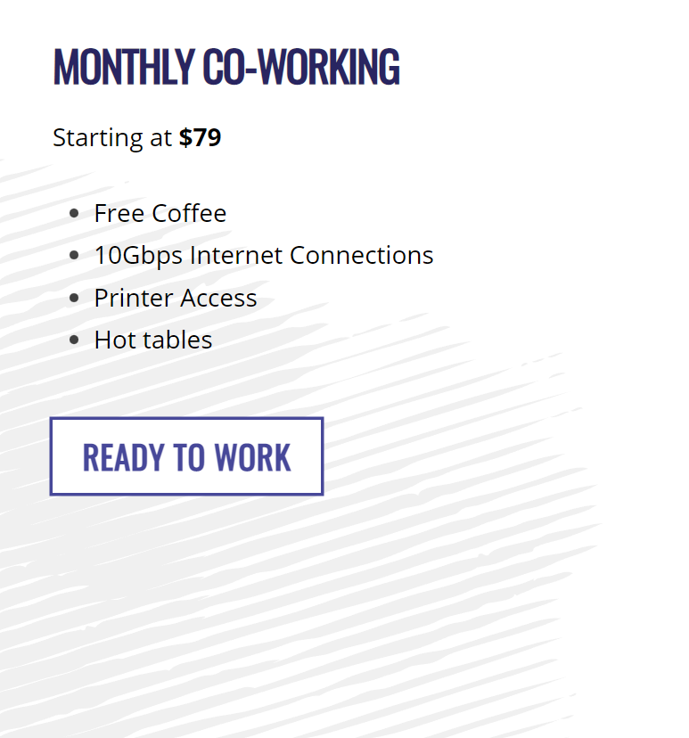
  </GrungeDemo>

