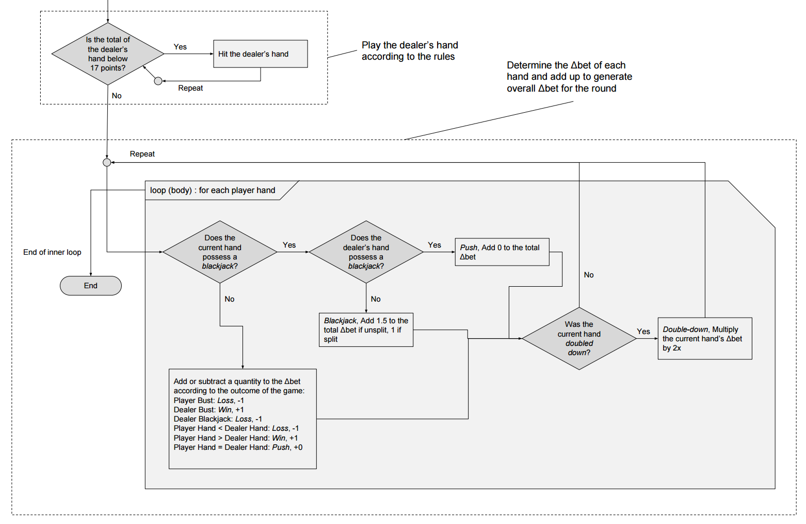
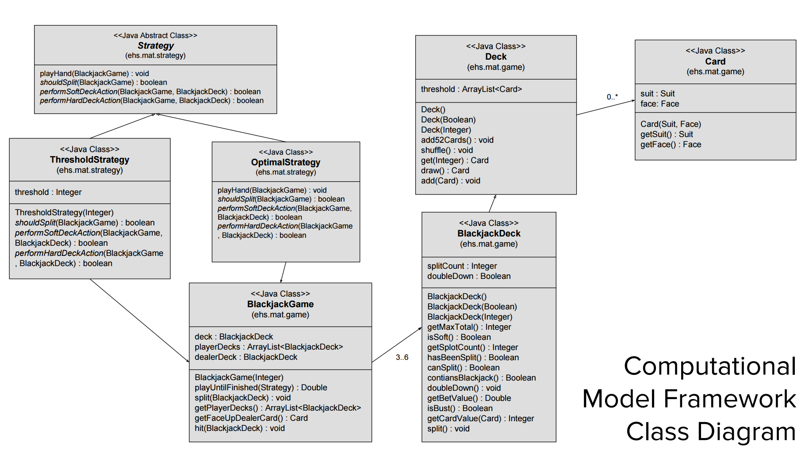

> Computational Model for Joseph Azevedo & Joshua Lagria's submission to the UTC Math Poster 2017 Competition, programmed in the programming language [Java](https://www.java.com/en/).

- [Main Testing Class](https://github.com/jazevedo620/Blackjack-Simulation/blob/master/src/ehs/mat/TestHarness.java)
- [Blackjack Gamestate Controller](https://github.com/jazevedo620/Blackjack-Simulation/blob/master/src/ehs/mat/game/BlackjackGame.java)
- [Blackjack Deck Object](https://github.com/jazevedo620/Blackjack-Simulation/blob/master/src/ehs/mat/game/BlackjackDeck.java)
- [Optimal Strategy](https://github.com/jazevedo620/Blackjack-Simulation/blob/master/src/ehs/mat/strategy/OptimalStrategy.java)
- [Threshold Strategy](https://github.com/jazevedo620/Blackjack-Simulation/blob/master/src/ehs/mat/strategy/ThresholdStrategy.java)

## 🔗 External Sources

- Optimal Strategy look-up tables retrieved from [WizardOfOdds.com](https://wizardofodds.com/games/blackjack/strategy/4-decks/)

## 📚 Documentation

<Figure sharp left caption="Functional Diagram" className="merged-figure">

</Figure>

<Figure sharp left caption="Class Diagram">

</Figure>
