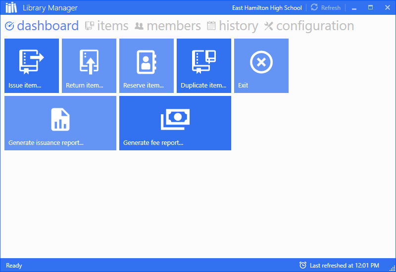
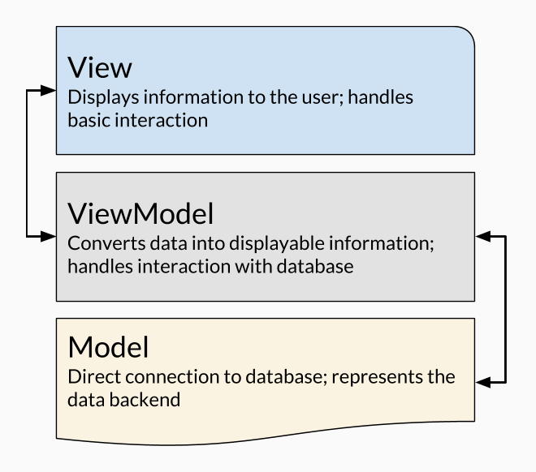

<Figure maxWidth={800}>
  
  <figcaption>
    Initial screen upon starting the application.
  </figcaption>
</Figure>

## 🏛 Underlying Architecture

As part of the design guidelines, Library Manager is a Client database programmed designed to be connected to a centralized database server. Instead of locally serving the database, the demo provided under Releases uses a sample dataset in order to showcase functionality.

Internally, Library Manager takes advantage of Microsoft's flagship .NET UI framework, Windows Presentation Foundation, or WPF. WPF works through two components: the design is programmed in **XAML**, or Extensible Application Markup Language (_different from XML_), while the behavior is programmed in **C#**. This separation of _design_ and _behavior_ is key to the framework's architecture, as it allows for the adoption of the Model-View-ViewModel design paradigm as outlined below.

<Figure maxWidth={500}>
  
  <figcaption>
    WPF MVVM Architecture overview
  </figcaption>
</Figure>

## 📚 Documentation

Extensible documentation was developed via LaTeX in order to explain each feature of the program, and is available as a [PDF document](/projects/library-manager/product-guide.pdf).

## 📐 Design Process

A brief slideshow discussing the development of the project has been created, and is available below.

<Iframe
  src="https://docs.google.com/presentation/d/e/2PACX-1vTGNy98lkIgXEggQ311Q4-lEVoktZXNi6ZJbzeMykYx1stRzgmh1ap6npJRz_zBeCNXJ6MNUN8nVQ-w/embed?start=false&loop=false&delayms=3000"
  width="960"
  height="569"
  allowFullScreen
  style={{ borderTopLeftRadius: 0, borderTopRightRadius: 0 }}
/>

## 🔗 Open Source External Packages

- [ControlsEx v3.0.2.4](https://github.com/ControlzEx/ControlzEx) by Jan Karger, Bastian Schmidt, and James Willock: provides useful UI controls and styling with which to build the application frontend
- [iTextSharp v5.5.13](https://github.com/itext/itextsharp) by Bruno Lowagie, Paulo Soares, et al: Open-source framework for PDF creation in C#; used for generating reports
- [MahApps.Metro v1.5.0](https://mahapps.com/) by Jan Karger, Dennis Daume, Brenden Forster, Paul Jenkins, Jake Ginnivan, and Alex Mitchel: provides UI styling for a majority of the elements in the application front-end in order to conform to Microsoft's Metro design paradigm within WPF applications
